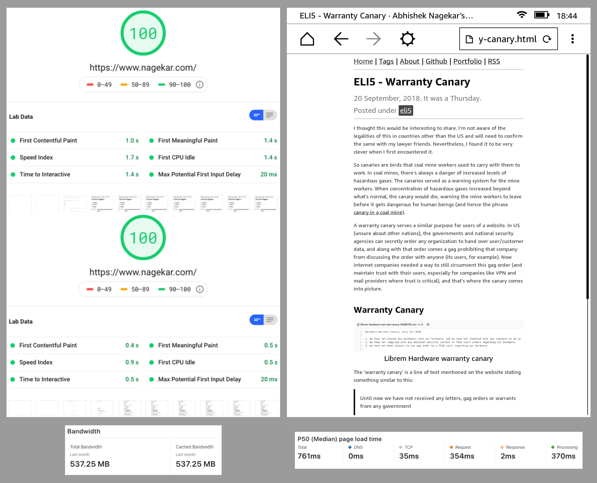

# Unmaintained - Blog moved to Wordpress
I've moved my blog to wordpress and ported this theme to Wordpress - [https://github.com/abhn/Elementary-Wordpress](https://github.com/abhn/Elementary-Wordpress).

Due to a crunch of time, updates here may or may not happen. Please check the Wordpress theme for updates.

Relevant blog article: [Life Goes Full Circle – Blog Back To WordPress](https://www.nagekar.com/2021/01/life-goes-full-circle-blog-back-to-wordpress.html)


# Elementary
This is my personal blog's Jekyll template that I've been optimizing for performance, accessibility, usability, readability and simplicity in general. 

I personally do not approve of personal blogs bloated with hundreds of kilobytes of trackers and analytics code, and hence, this is an attempt at creating something that I'd be comfortable with using on my website.

### Performance


Images from my website (clockwise from top left)

- Perfect **100 Google Page Speed score** on both mobile and desktop
- **Kindle's experimental browser** running the theme
- Median load time (From Cloudflare) is **less than a second**
- **100% cached** by Cloudflare CDN

### Dark mode


Note: Dark mode requires JavaScript

### Scroll progress


Note: Scroll progress requires JavaScript

### Demo
<a href="https://elementary-jekyll.github.io/">https://elementary-jekyll.github.io/</a>

### Features
- Lightweight, <10KB CSS, <3KB (optional) JavaScript + 15KB Open Sans font file + your content
- Highly accessible with semantic HTML
- Structured data ([schema.org](https://schema.org)) pre-added for blog posts
- Dark mode (requires JavaScript for toggling class and saving user preference in cookies)
- Reading progress slider on top (requires JavaScript)
- JavaScript is optional (turn it off in `_config.yml`)
- No request made to any third party
- Any much more...

### Installation (Prerequisite: A working Jekyll site)
- If you don't have a Jekyll site, read up how to create one here: [https://jekyllrb.com/docs/](https://jekyllrb.com/docs/)
- Add Elementary repository as a submodule to your Jekyll blog by running the following command.
```
git submodule add git@github.com:abhn/Elementary.git elementary
```
- Tell Jekyll it has to use Elementary as theme by adding the following to your `_config.yml` (in case you're wondering where, just add it to the bottom on a new line). 
```
theme: elementary
```
- Add the following to your `Gemfile`
```
source 'https://rubygems.org'
gem 'elementary', path: 'elementary'
```
- Run `bundle install` command in your project directory and make sure there are no errors
- Add `./elementary` to `exclude` section of `_config.yml` so that the theme's files aren't compiled into the final site by adding the following to your `_config.yml` (if `exclude` key exists, just add a new item to it)
```
exclude:
  - ./elementary
```
- Run command `bundle exec jekyll serve` to run local server (open browser to [http://localhost:4000](http://localhost:4000) to view the site).
- Run command `bundle exec jekyll build` to output a production build to the `_site` directory.

### Customization
- You're free to make any edits to the theme's files in the submodule. You can also `git pull origin master` from the submodule directory to update the theme in case I push updates, but you don't have to.
- In `_config.yml`, you can add new collections (groups of new content, so blog posts, news, pictures could all be their own collections with separate listing on index page)

### Credits
- Eric S Raymond (http://www.catb.org/~esr/hacker-emblem/glider.png) for the favicon

### License
GNU GENERAL PUBLIC LICENSE Version 3

### Going v1.0
When I started with the [original project](https://github.com/abhn/Elementary/releases/tag/v0.1) around 2 years ago, my goal was to get rid of all that unnecessary code and progressively add only the most essential bits. 

I feel like the theme is in good enough shape right now that I can call it a v1.0

-----

### Original inspiration

I recently read in a blog post that a personal blog has to be fast and lean. There's no reason for a personal blog to be bloated and take 2 seconds to load. That was when I reviewed my own blog code and started analyzing. I discovered that I was loading jQuery just for another jQuery plugin which just helped the images and videos to be mobile responsive. That was some 40KB of overhead, 2 additional requests which could have been prevented with just a `max-width: 100%` attribute to the culprit elements. Similarly, there was Disqus which loaded tonnes of scripts along with its own Google Analytics script. 

I went on stripping weight from the code, and was left with something what you see here. Few extra CSS tweaks and Tadaa!
