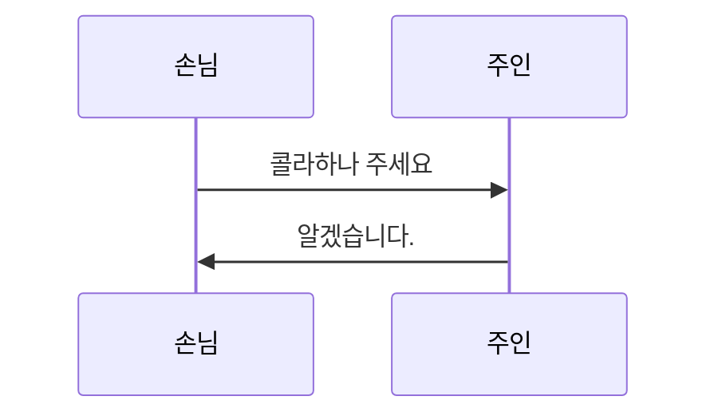

`vscode` 에서 작업을 진행할 때, backend, frontend 등의 다수 터미널을 활용하는 경우가 많습니다. 지금까지는 [tmux](https://yongbeomkim.github.io/ubuntu/tmux)를 사용하고 있었는데 1가지 문제가 있었습니다. 그 내용은 다중화면 터미널을 실행할 때, 실행내용을 클립보드로 복사하기가 까다롭다는 문제가 있습니다.

이러한 원인으로 대안들을 찾게 되었고, tmux 의 대안으로 떠오르는 [Zellij](https://github.com/zellij-org/zellij)를 알게 되었습니다. [Zellij vs Tmux: Complete Comparison (or almost)](https://rrmartins.medium.com/zellij-vs-tmux-complete-comparison-or-almost-8e5b57d234ae) 를 살펴보면 이러한 내용을 알 수 있습니다.

<br/>

# Install
설치방법은 [Zellij User Guide - Installation](https://zellij.dev/documentation/installation.html) 공식문서를 확인합니다. 설치와 관련한 보다 자세한 내용은 [TMUX보다 조금 편한 터미널 멀티플렛서 Zellij](https://pinkwink.kr/1470)를 참고 합니다. 설치를 완료하면 다음과 같은 화면으로 시작 합니다.

<figure class="align-center">
  <p style="text-align: center">
  
  </p>
</figure>

처음 시작하시는 분들은 1번 설정을 선택하고 실행하면 됩니다.

<br/>

# Xcopy Clipboard
`Ctrl + p` 단축키는 `패널` 관련 기능들을 활용할 수 있습니다. 

`Ctrl + g` 단축키는 `Copy-Mode` 환경입니다. 하지만 일반적인 설치를 한 뒤에는 블록설정 등 변화가 없는것을 볼 수 있습니다. 이제부터 선택된 텍스트가 시스템 클립보드로 자동 복사되도록 추가 설정작업을 진행합니다.

현재 작업중인 환경에서 Display Session 내용을 확인합니다. 아랫결과 `X11 (Ubuntu 기본 GUI 환경)` 로 표시됩니다. 시스템 복사를 위한 `xclip` 를 설치합니다.
```bash
$ echo $XDG_SESSION_TYPE  
x11

$ sudo apt install xclip
```

`zellij` 의 설정파일을 확인하고 `copy_command "xclip -selection clipboard"` 내용을 전역변수로 추가 합니다.
```bash
$ nvim ~/.config/zellij/config.kdl

copy_command "xclip -selection clipboard"

keybinds clear-defaults=true {

    locked {
        bind "Ctrl g" { SwitchToMode "normal"; }
        ...
    }
}
```

이렇게 설정을 완료하고 나서 `zellij`를 실행합니다. Copy-mode `Ctrl + g` 로 진입해서 블록으로 원하는 텍스트를 선택한 뒤 `Enter` 를 입력하면 System Clip board 로 전송됩니다. 그 뒤 필요한 작업들은 진행하면 됩니다.

<br/>

# 참고사이트
- [Zellij User Guide](https://zellij.dev/documentation/)
- [TMUX보다 조금 편한 터미널 멀티플렛서 Zellij](https://pinkwink.kr/1470)


