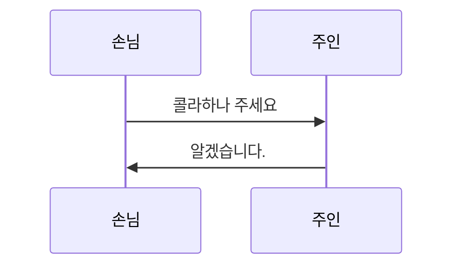

`닌텐도 Wii` 와 `닌텐도 Wii U` 는 2013년 과 2017년에 생산 중단되었고, 이때 개발된 [Wii Game Roms](https://myrient.erista.me/files/Redump/Nintendo%20-%20Wii%20-%20NKit%20RVZ%20[zstd-19-128k]/) 들은 [Dolphin Emulator](https://kr.dolphin-emu.org/) 를 사용하면 안드로이드, 윈도우, 리눅스에서 즐길 수 있습니다.

`Yuzu` 는 안드로이드 환경에서 Nintendo Switch 를 구동할 수 있는 에뮬레이터 입니다. 2024년 닌텐도와의 소송으로 개발은 전면 중단되었고, 안드로이드 환경에서는 [Egg NS Emulator](https://eggnsemulator.com/home/) 로 대체되는 과정 입니다. 그밖의 리눅스 환경 에서는 [Ryujinx](https://github.com/Ryubing/Ryujinx) 등이 현재까지도 업데이트가 진행되고 있습니다.

이번 페이지는 현재는 개발이 종료된 `Yuzu` 에 대하여 설치 및 설정과 관련된 내용들을 정리해 보겠습니다.

 

# Install
## Yuzu
[XForYouX / Yuzu-Android-9](https://github.com/XForYouX/Yuzu-Android-9/releases/tag/Alpha-V.24) 등을 검색하여 가장 마지막 버젼을 다운받고 설치를 진행 합니다.

## Product Key
설치 후 최초 설정 과정에서 Switch 기기의 Key 값을 요청합니다. 이부분은 검색을 통해서 해결 합니다.

## 한글 활성화
[안드로이드에뮬레이터 갤러리 - 안드 YUZU 한글깨짐 현상 해결하는법](https://gall.dcinside.com/mgallery/board/view/?id=androemu&no=1571) 를 참고하여 작업을 진행 합니다.

 

# Setting
## GPU
실제로 동작을 해보면, CPU 쓰로틀 및 GPU 충돌 및 멈춤으로 인하여 정상적인 진행이 잘 안되는 경우가 많습니다. 따라서 자신의 환경에 맞는 설정과 GPU 드라이버를 설치하면 보다 성공적인 플레이가 가능할 것입니다.

[K11MCH1/ AdrenoToolsDrivers](https://github.com/K11MCH1/AdrenoToolsDrivers/releases) 에서 자신의 기기에 맞는 드라이버를 찾아서 압축을 풀지 않은 그대로 설정에 추가를 하면 됩니다. 적용결과 안되던 내용이 되는경우는 거의 없고, 최적화가 덜 되었던 게임을 원활하게 동작하는데 도움이 되었습니다.

 

# 마무리
안드로이드 환경에서 에뮬레이터는 `nintendo Wii` 등과 같이 최적화 등이 모두 해결된 내용이거나, winlator 와 같이 사용자가 설정값을 보다 자유롭게 변경 가능한 내용으로 향후 진행하는게 더 좋을거 같습니다.

# 참고사이트
- [안드로이드 yuzu 그래픽 드라이버 설치](https://jabda-blog.tistory.com/entry/yuzu-driver)
- [Prod.keys](https://prodkeys.net/yuzu-prod-keys-v9/)

> [!note]
> 이건 참고용 Callout입니다.
> 여러줄에 걸쳐서 입력가능

> [!WARNING]
> 백업 없이 실행하지 마세요!

[문서링크 | file path](https://google.com)

